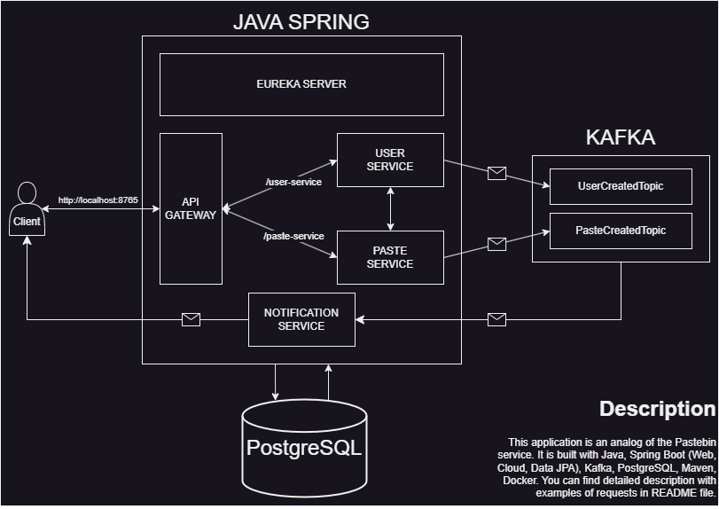

# NEWPASTEBIN PROJECT
### This application is built on Java, Spring Boot (Web, Data JPA, Cloud), Kafka, PostgreSQL, Liquibase, divided on several microservices and containerized with docker-compose

# Eureka server:  
### The server where the microservices running in the application are registered. It starts on the port 8761.

# API-gateway:
### Routes HTTP-requests between 2 services: user-service and paste-service. It starts on the port 8765.

# User-service: 
### Processes user-related requests. It is divided into layers (repository, service, controller). This service connected to database (table "users") and Kafka (topic "UserCreatedTopic"). It also can send HTTP-requests to paste-service with Feign Client. It starts on port 8082.

# Paste-service:
### Processes paste-related requests. It is divided into layers (repository, service, controller). This service connected to database (table "paste") and Kafka (topic "PasteCreatedTopic"). It also can send HTTP-requests to user-service with Feign Client. It starts on port 8081.

# Notification-service:
### Listen both Kafka topics. Send email notifications when receiving a message about creation of user or paste.

# PostgreSQL:
### Database with tables "users" and "paste":  
### Users

| id (bigint) | username (varchar) | email (varchar) | password (varchar) |
|-------------|--------------------|-----------------|--------------------|

### Paste 
#### ENUMS: Access(PUBLIC, UNLISTED), PasteDuration(TEN_SEC, ONE_MIN, TEN_MIN, ONE_HOUR, THREE_HOUR, ONE_DAY, ONE_WEEK, ONE_MONTH, INFINITY)

| id (bigint) | name (varchar) | body (varchar) | url (varchar) | creation_time (timestamp) | expired_time (timestamp) | access (varchar) | user_id (bigint) |
|-------------|----------------|----------------|---------------|---------------------------|--------------------------|------------------|------------------|

# Liquibase:
### Liquibase create both tables and add 1 user to table "users".

# Docker:   
### To launch application containers use "docker-compose up -d".
### You can also set "SENDER_EMAIL_PASSWORD" and "SENDER_EMAIL_USERNAME" environment variables (notification_service) for sending emails. 

# HTTP-requests:  
### **1. Create user:**  
#### Create user with parameters obtained from the request's body
#### http://localhost:8765/user-service/create   
#### PUT-method, JSON body example:  
_{  
   "username": "JoeBiden",  
   "email": "WakeUp@gmail.com",  
   "password": "MrPresident"  
}_
### **2. Update user:**  
#### Update user with id = user_id
####  http://localhost:8765/user-service/update/{user_id}
#### PATCH-method, JSON body example:
_{  
"username": "JoeBiden",  
"email": "WakeUp@gmail.com",  
"password": "MrPresident"  
}_
### **3. All users:**
#### Returns all created users
#### http://localhost:8765/user-service/
#### GET-method, no body
### **4. Delete user:**
#### Delete user with id = user_id
#### http://localhost:8765/user-service/delete/{user_id}
#### DELETE-method, empty body
### **5. Create paste:**
#### Create paste with parameters obtained from the request's body, author id = user_id, returns URL of created paste
#### http://localhost:8765/paste-service/create/{user_id}
#### PUT-method, JSON body example:
_{  
"name": "Anecdote",  
"body": "The man put on a hat, and it was just for him",  
"pasteDuration": "ONE_HOUR",  
"access": "PUBLIC"  
}_  
### **6. Find paste by URL:**
#### Returns paste with paste-code (String url in entity) if it is available
#### http://localhost:8765/paste-service/{paste-code}
#### GET-method, no body
### **7. Find public pastes:**
#### Returns the latest 10 public pastes ordered by creation time
#### http://localhost:8765/paste-service/public
#### GET-method, no body  
### **8. Find user's public pastes:**
#### Returns user's public pastes ordered by creation time
#### http://localhost:8765/paste-service/user/{user_id}
#### GET-method, no body
